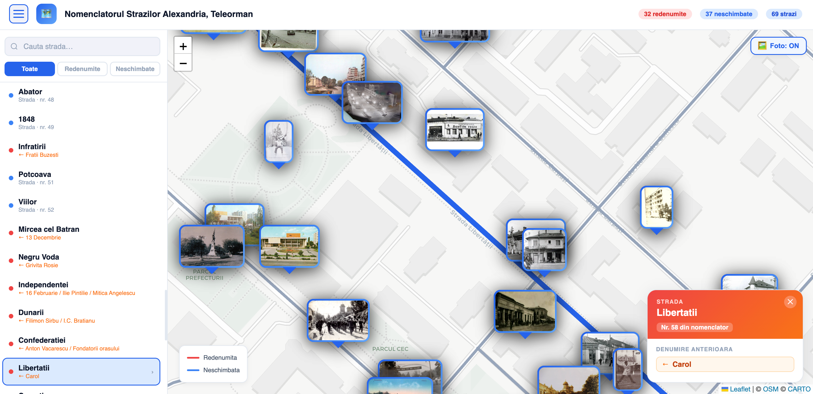
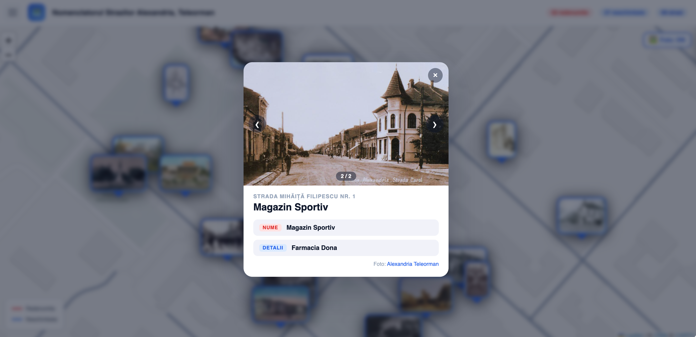

# Old Alexandria

An interactive map of every street in Alexandria, Teleorman, based on **HCL nr. 323 / 28 November 2013** — the local council decision that officially renamed each street following the fall of communism in 1989. For every street you can see its current name, its old communist-era name(s), and its exact location highlighted on the map.



---

## What you can do with it

- **Browse all streets** from the official 2013 nomenclature using the sidebar — open it with the menu button in the top-left corner.
- **Search by name** — type any part of a street name to filter the list instantly.
- **Switch between views** — see all streets, only the renamed ones, or only the ones that kept their name.
- **Click any street** — either in the list or directly on the map — to highlight it and see its full history.
- **Discover old names** — streets that were renamed show all their previous communist-era names in a detail panel.
- **Explore historical photo markers** — rectangular photo pins placed at specific locations show archival photographs. Click any pin to open a full-size modal. Use the **🖼 Foto** toggle button on the map to show or hide all photo markers at once.

---

## Historical photo markers

Archival photographs are pinned directly on the map as rectangular photo frames with a blue gradient border and a location pointer. Clicking a marker opens a modal with the full image, the location address, and the name and details of the place.



*Alexandria — Școala Primară Nr. 1, Str. Libertății nr. 148. Now: Școala gimnazială Mihai Eminescu.*

### Multiple photos per location

Some locations have more than one archival photograph. When a marker has multiple images, the modal shows **‹ ›** navigation buttons on the image and a `1 / N` counter. You can also navigate with the **← →** arrow keys on your keyboard.

### Show / hide photo markers

A **🖼 Foto: ON / OFF** button floats in the top-right corner of the map. Clicking it hides or reveals all photo pins without affecting the street layer.

### Adding a new marker

1. Place the image file in `src/locations/`.
2. Import it in `src/data/photoMarkers.js`.
3. Add an entry with:

```js
{
  id: <next_id>,
  latlng: [lat, lng],
  photo: importedImage,          // used for the map pin thumbnail
  label: 'Place name',
  location: 'Street address',    // or null
  oldName: 'Historical name',
  newName: 'Current name',       // leave '' if unchanged
  // optional — enables carousel in the modal:
  photos: [
    { src: importedImage,  sublabel: 'Caption for photo 1' },
    { src: anotherImage,   sublabel: 'Caption for photo 2' },
  ],
}
```

Archival photographs courtesy of the Facebook page **[Alexandria Teleorman](https://www.facebook.com/Alexandria.Teleorman.Romania)**.

---

## Where the data comes from

The street list was transcribed by hand from HCL nr. 323, the official municipal document. Each entry records the street's current name, its type (Strada, Aleea, Bulevardul, etc.), and any names it carried before 1989.

The map itself is powered by **OpenStreetMap** — a free, community-maintained map of the world — through two services:

- **Overpass API** — used on first load to fetch all named roads within the city boundaries of Alexandria. The result is drawn as coloured lines: blue for streets found in the nomenclature, grey for everything else.
- **Nominatim** — used as a fallback when a specific street can't be found in the bulk data, to look it up by name and pin it approximately on the map.

Both services are free and require no account or API key. Results are cached locally in the browser (7 and 30 days respectively) so the same query is never repeated unnecessarily.

---

## Mobile support

The app is fully responsive:

- The sidebar becomes a **slide-in overlay** on small screens, with a backdrop that dismisses it on tap.
- The detail card becomes a **bottom sheet** that slides up from the bottom of the screen.
- The top bar hides the statistics pills to save space.

---

## Built with

| What | Technology |
|------|------------|
| Interface | React 18 |
| Build tool | Vite |
| Map display | Leaflet + react-leaflet |
| Map tiles | CartoDB Light (free, no account needed) |
| Street data | OpenStreetMap via Overpass API and Nominatim |
| Font | Inter (bundled — no external requests) |

---
