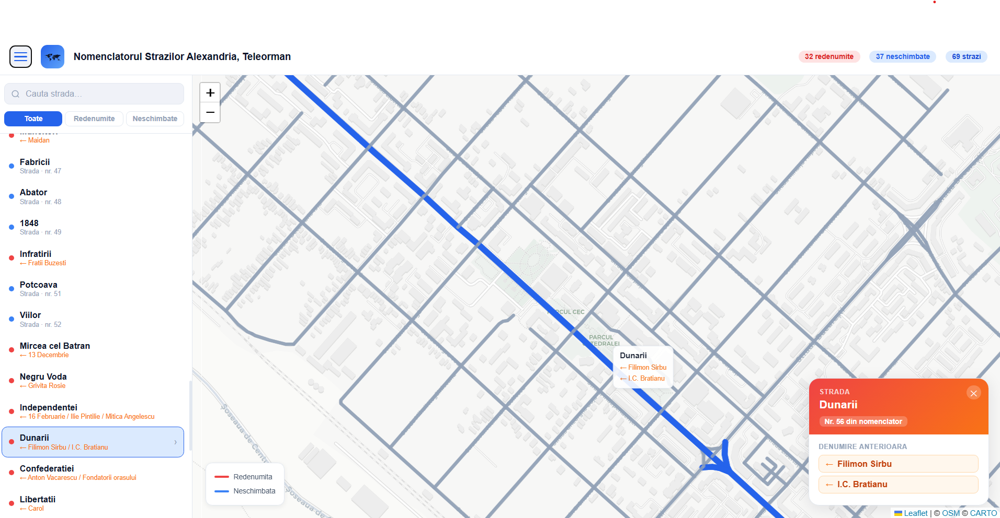

# Old Alexandria

An interactive map of every street in Alexandria, Teleorman, based on **HCL nr. 323 / 28 november 2013** — the local council decision that officially renamed (or confirmed) each street following the fall of communism in 1989. For every street you can see its current name, its old communist-era name(s), and its exact location highlighted on the map.

---

## What you can do with it

- **Browse all streets** from the official 2013 nomenclature using the sidebar — open it with the menu button in the top-left corner.
- **Search by name** — type any part of a street name to filter the list instantly.
- **Switch between views** — see all streets, only the renamed ones, or only the ones that kept their name.
- **Click any street** — either in the list or directly on the map — to highlight it and see its full history.
- **Discover old names** — streets that were renamed show all their previous communist-era names in a detail panel.

---

## Where the data comes from

The street list was transcribed by hand from HCL nr. 323, the official municipal document. Each entry records the street's current name, its type (Strada, Aleea, Bulevardul, etc.), and any names it carried before 1989.

The map itself is powered by **OpenStreetMap** — a free, community-maintained map of the world — through two services:

- **Overpass API** — used on first load to fetch all named roads within the city boundaries of Alexandria. The result is drawn as coloured lines on the map: blue for streets found in the nomenclature, grey for everything else.
- **Nominatim** — used as a fallback when a specific street can't be found in the bulk data, to look it up by name and pin it on the map.

Both services are free and require no account or API key. To be a good citizen of these shared services, results are saved locally in your browser (for 7 and 30 days respectively) so the same query is never repeated unnecessarily.

---

## Built with

| What | Technology |
|------|------------|
| Interface | React 18 — a popular library for building interactive web pages |
| Build tool | Vite — packages and serves the app |
| Map display | Leaflet + react-leaflet — the most widely used open-source map library |
| Map tiles | CartoDB Voyager Light — the background map imagery (free, no account needed) |
| Street data | OpenStreetMap via Overpass API and Nominatim |
| Font | Inter (bundled with the app — no external requests) |

---
